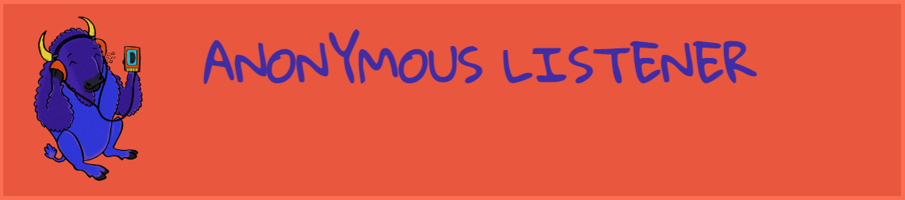
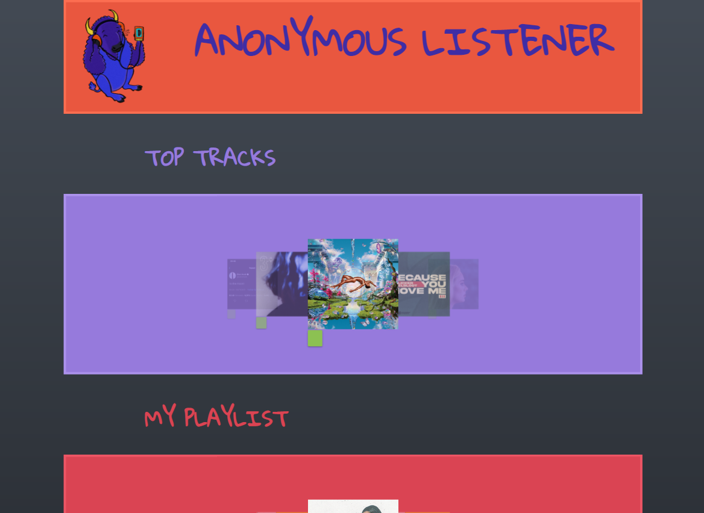

# Anonymous-Listener
---
## Description
Capture the youth interest of what the artists look like and what the music video is - keeping track of the top 50 artists of the day. Allows the user to click on an artist of their choice and watch that artist’s most popular youtube music video. The application will also allow the user to save their favorite videos for future reference.

## User Story

```
AS A music enthusiast
I want to select a popular artist from SoundCloud, er, Spotify, er, Deezer, er,              BandsInTown, er, Napster
So that I can watch one of their videos.
```

## Appearance
This image shows the Anonymous Listener web application's appearance and functionality:


## Technology used:
* Materialize
* Napster
* Youtube
* Google Fonts
* Flattasic Pro color pallet by Erigon (https://dribbble.com/shots/1186718-Flattastic-Pro-Color-Palette/attachments/156469?mode=media) 

## Resources
Buffalo with headphones original image by (https://finalproblem.tumblr.com/image/45961609773).

## Future Development
* Once we learn oAuth and Cors, we can use other APIs
* Add other functions we didn’t get to develop: multiple playlists, automatic playthrough/playback
* Remove favorites from the list
* App remembers where you were on the track last
* Load speeds

## Project Requirements

```
You and your group will use everything you’ve learned over the past six units to create a real-world front-end application that you’ll be able to showcase to potential employers. The user story and acceptance criteria will depend on the project that you create, but your project must fulfil the following requirements:
    -Use a CSS framework other than Bootstrap.
    -Be deployed to GitHub Pages.
    -Be interactive (i.e., accept and respond to user input).
    -Use at least two server-side APIs.
    -Does not use alerts, confirms, or prompts (use modals).
    -Use client-side storage to store persistent data.
    -Be responsive.
    -Have a polished UI.
    -Have a clean repository that meets quality coding standards (file structure, naming conventions, follows best practices for class/ id naming conventions, indentation, quality comments, etc.).
    -Have a quality README (with unique name, description, technologies used, screenshot, and link to deployed application).
```

## Deployment
<a href="https://amccorkl.github.io/Anonymous-Listener/" target="_blank">
    
</a>

